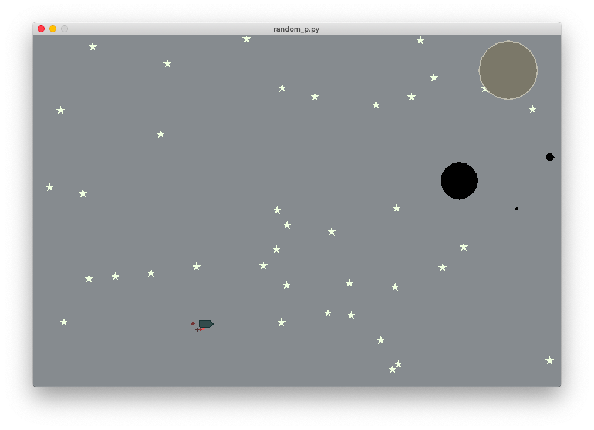

# Rocket_Optimization Reinforcement Learning Environment

* This code used code of OpenAI Gym Environment LunarLander as skeleton code.

# Explanation
* The goal of this environment is make agent reach to the target planet(big gray one) without crashing into its satellites(black small ones).
* Agent(Rocket) has 4 discrete actions, doing nothing going left, going right, and going front.
* Agent gets rewards based on the distance between target planet and itself. It gets bigger rewards when it hits the target planent.

## Prerequisites

* python3
* gym

## Setup

* Clone this repository and type below command
* $ pip install -e rocket-opt

## Running Example Random Policy

* direct to example folder which includes a file "example_random_policy.py"
* type command : $ python example_random_policy.py

## Sample Screenshot

## Author

Wonjun Son / [Github](https://github.com/wongongv)